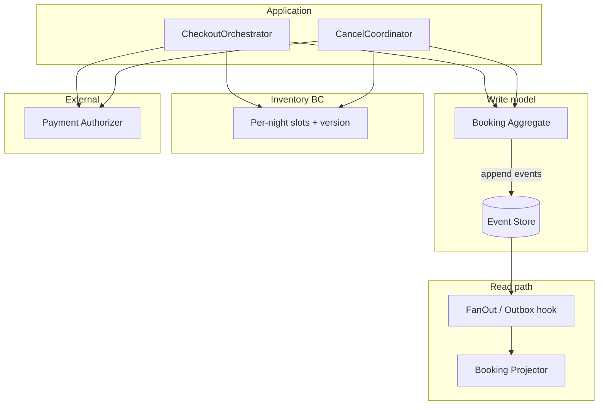

# booking-engine

Reference architecture for hotel/PMS booking: event-sourced orders, per-night inventory with optimistic locking, cancel flow as a saga.

**Problem:** booking touches three consistency boundaries (order state, room-night stock, payment auth). A single DB transaction does not span all of them. This repo shows how to keep correctness anyway.

## Architecture



## Key decisions

| Area | Choice | Why |
|------|--------|-----|
| Booking state | Event sourcing | Audit trail, replay, rebuild read models after bugs |
| Inventory | Separate model + `version` column | Many bookings compete for same night; don't serialize via one aggregate |
| Concurrent writes | Optimistic concurrency (`expectedVersion`) | Higher throughput than row locks; client retries on conflict |
| Cancel | Choreographed saga, checkpointed steps | No cross-service 2PC; resume after crash; void payment before releasing stock |
| Read model | Projector via fan-out | Production: same-txn outbox insert instead of sync callback |
| Schema | `internal/migrations/schema_v1.sql` | DDL reference for Postgres deploy |

## Run locally

```bash
go test ./... -race   # preferred
make demo             # checkout → cancel → replay
```

## Test coverage

| Package | What |
|---------|------|
| `domain/booking` | Lifecycle, replay, invalid transitions, validation |
| `eventsourcing` | Append concurrency (`-race`), fan-out |
| `inventory` | Optimistic reserve conflicts, 50-way race, rollback on OOS |
| `app` | E2E flow, payment failure compensation, duplicate ID, bad input |
| `payment` | Injected provider failures |
| `saga` | Complete cancel, idempotency, resume, void failure leaves booking intact |

## Layout

```
internal/
  domain/booking/   aggregate + events
  migrations/       SQL schema (v1)
  eventsourcing/    store, fan-out
  persistence/      repo + projector
  inventory/        stock + holds
  payment/          Authorizer + fault injector
  saga/             cancel coordinator
  app/              checkout
cmd/demo/
```

Details: [docs/ARCHITECTURE.md](docs/ARCHITECTURE.md)
